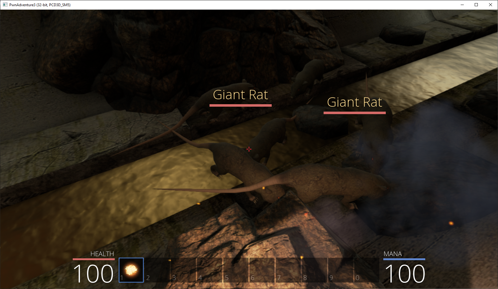

[[Zurück zur Theorie]](index.md)

# 1. Temporary Hacking: Memory Scanning - Beispielanwendung
Das Konzept von Lebenspunkten findet sich in vielen Spielen, so auch in _Pwn Adventure 3: Pwnie Island_. In diesem Abschnitt werden wir Memory Scanning einsetzen, um die Speicheradresse unserer Lebenspunkte zu finden und anschließend zu ändern!
1. Wir starten das Spiel und Cheat Engine

2. Nun wählen wir den Prozess des Spiels aus.

3. Unsere Lebenspunkte betragen `100`, also geben wir diesen Wert im Feld _"Value"_ ein und starten mit _"New Scan"_ einen neuen Scan.

4. Wir haben ca. 20.000 Adressen gefunden, diese reduzieren wir jetzt: in der Umgebung laufen Ratten herum, die uns Schaden hinzufügen können. Also nehmen wir etwas Schaden...

5. Nun suchen wir nach dem neuen, geänderten Wert `92`, indem wir den Wert im _"Value"_-Feld eintragen und auf _"Next Scan"_ klicken.

6. Jetzt sind nur noch gut 40 Adressen übrig und unsere Lebenspunkte haben sich schon regeneriert. Das sehen wir auch im Bild oben: die Adressen beinhalten bereits den neuen Wert `100`.

7. Finden wir nun von den 40 Adressen die eine, die tatsächlich unsere Lebenspunkte beeinflusst. Hierfür fügen wir alle Adressen unserer _"Address List"_ hinzu, indem wir sie auswählen und den roten Pfeil _"Copy all selected items to the address list"_ klicken. 

8. Mit einer binären Suche filtern wir jetzt die Adressen: wir wählen die ersten 20 Adressen aus und ändern ihren Wert ([Enter]) auf z.B. `999`. Die Adressen werden aber sofort wieder vom Spiel überschrieben, sie speichern also unsere Lebenspunkte, bestimmen aber nicht deren Wert: löschen wir diese Adressen.

9. Wie wiederholen diese binäre Filterung bis nur noch eine handvoll Adressen übrig sind. Hier sind es nur noch vier: diese ändern wir händisch und finden so heraus, dass in diesem Fall die Adresse `44353380` unsere Lebenspunkte bestimmt. 

10. Ändern wir diese auf `999` so sehen wir die Änderung an den anderen Adressen und im Spiel! 

[[Weiter zu den Übungen]](02-excercises.md)