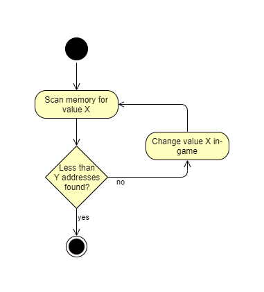

# 1. Temporary Hacking: Memory Scanning
In diesem Workshop werden wir zuerst mit einem sehr wichtigen und auch ziemlich einfachen Konzept beginnen: Memory Scanning! Es wird verwendet, um interessante Arbeitsspeicheradressen (zum Beispiel Lebens- oder Erfahrungspunkte) zu finden und zu manipulieren.

## Der Algorithmus
Der Ablauf hierbei ist ziemlich einfach und kann als einfacher Algorithmus dargestellt werden:
1. Zuerst identifiziert man einen Wert "_X_", den man im Weiteren gerne verändern möchte (zum Beispiel `100` Lebenspunkte) und durchsucht den Arbeitsspeicher des Spiels nach diesem Wert. Für gewöhnlich wird man hunderttausende Adressen finden, die diesen Wert beinhalten.
2. Nun gilt es, die eine Adresse im Arbeitsspeicher zu finden, die den tatsächlichen Wert von *X* bestimmt. Hierzu ändern wir diesen Wert im Spiel, etwa dadurch, dass wir Lebenspunkte verlieren, und überprüfen unsere in **1** gefundenen Adressen darauf, dass sie den aktuellen Wert beinhalten. Viele der anfangs gefundenen Adressen werden nicht den aktuellen Wert aufweisen - daraus kann geschlossen werden, dass sie keinen Einfluss auf den tatsächlichen Wert von *X* haben!
3. Schritt **2** wird so häufig wiederholt, bis nur noch wenige (<= *Y*) Adressen übrig bleiben, die den aktuellen Wert von *X* besitzen. Dies sollten so wenige Adressen sein, dass man sie händisch überprüfen kann (und möchte) - je weniger, desto besser (da weniger Aufwand)!
4. Nun können die übrig gebliebenen Adressen händisch geändert werden: sobald eine Änderung einer Adresse 



Derselbe Algorithmus als einfacher Pseudocode:
```
// Suche nach Arbeitsspeicheradressen mit dem Wert X
addresses = scanAllMemoryFor(X)
while addresses.length > Y do
    // Erzwinge Wertänderung von X (im Spiel)
    change(X) 
    // Filtere die Adressen nach dem neuen Wert von X
    addresses = scanMemoryFor(addresses, X)
end
```

## Vor- und Nachteile des Memory Scanning
Ein großer Vorteil von Memory Scanning ist, dass es ein schnelles Verfahren ist, dass für die meisten Fälle in kurzer Zeit brauchbare Ergebnisse liefert. Es kann sogar komplett ausreichen, wenn man nur wenige einfache Werte ändern möchte, wie zum Beispiel Lebens- oder Erfahrungspunkte. Besonders in der ersten Phase des Gamehackings liefert es nützliche Hinweise darauf, wie Daten in Spielen organisiert werden und an welchen Stellen sich weiteres Nachschauen lohnen kann (dazu mehr in späteren Kapiteln).

Memory Scanning ist aber kein Alleskönner, in manchen Fällen kann es auch überhaupt nicht eingesetzt werden: wenn die zu findenden Werte beispielsweise durch das Spiel schneller geändert werden als man nach ihnen scannen lassen kann. In anderen Fällen ist es schlichtweg unmöglich, die Menge der gefundenen Adressen auf eine überschaubare und handhabbare Anzahl zu reduzieren. Das bedeutet dann einen immensen Aufwand beim händischen Überprüfen der Adressen.